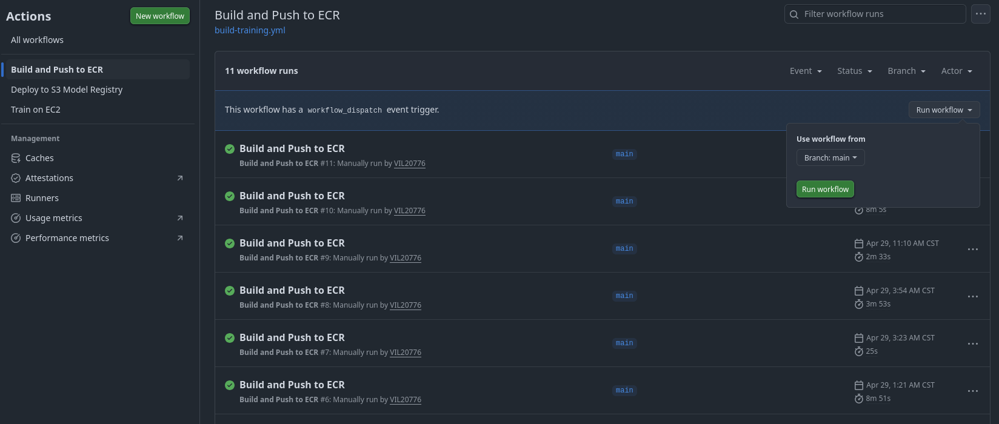
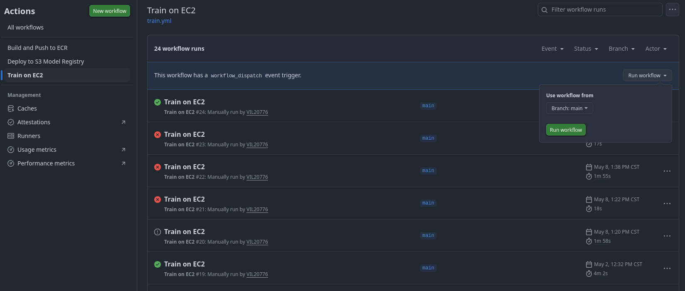
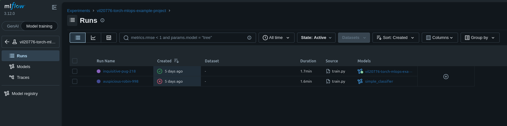
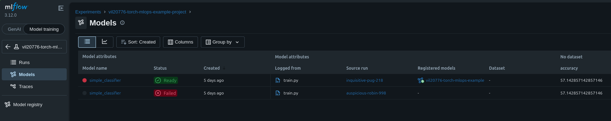
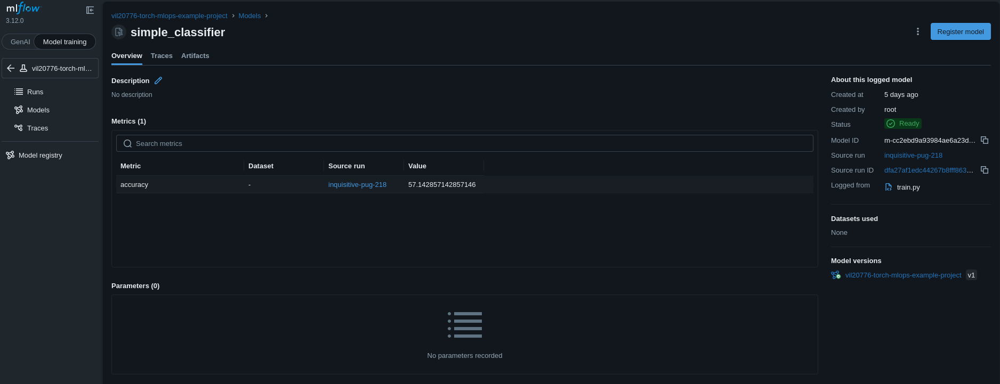
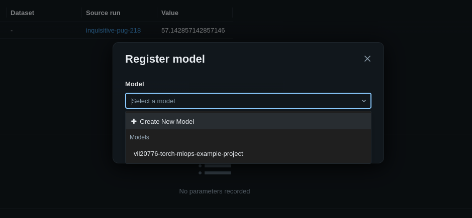
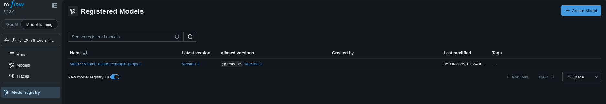
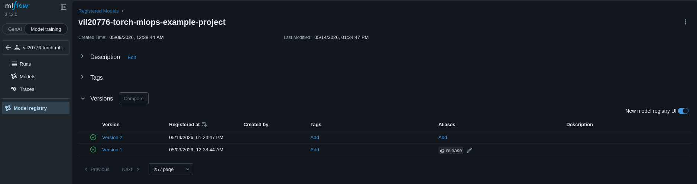
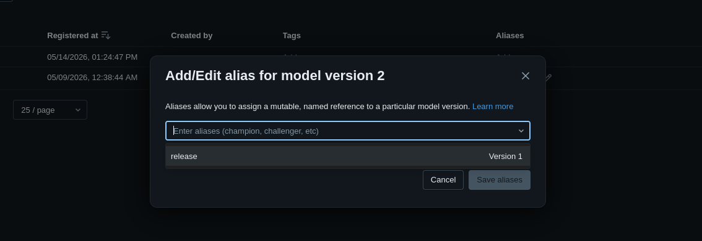
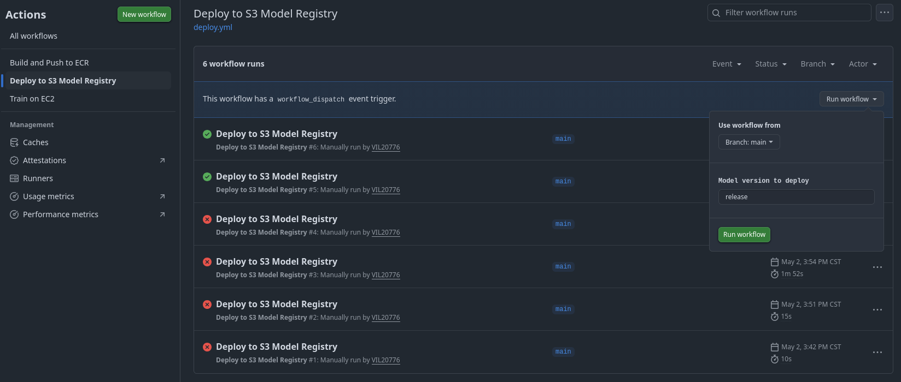

# Flujo de trabajo
A continuación se describe en rasgos generales el flujo de trabajo que deberían seguir los investigadores que hagan uso de la infraestructura.
1. Desarrolle el modelo integrando MLFlow para llevar seguimiento de resultados.
2. Una vez creado el modelo, construya la imagen de Docker para el entrenamiento. Esta imagen debería poder ejecutar el entrenamiento del modelo de forma reproducible.
3. En el repositorio de Github, dirijase a la pestaña Actions y ejecute el workflow "Build and Push to ECR" para subir la imagen a la infraestructura.

4. A continuación, ejecute el workflow "Train on EC2" para comenzar el entrenamiento.

Una vez termine, las runs definidas en el código de entrenamiento/experimentación deberían ser visible en la interfaz de MLFlow en Model Training > Experiments > Nombre-del-proyecto. 

IMPORTANTE: Tome en cuenta que cuando el workflow se completa de forma exitosa, unicamente inidica que la instancia de entrenamiento fue inicializada. Espere unos minutos hasta que vea su Run en la interfaz.
5. En esa misma ventana, vaya a la pestaña de Models donde podrá encontrar los modelos generados por las Runs que haya definido. Haga clic en el modelo que desee examinar.

6. Aquí verá la información recolectada por las Runs (si usó múltiples runs para probar un solo modelo), parametros y otros datos relacionados. Para registrar el modelo en MLFlow, haga click en el botón 'Register Model'

7. Registre el modelo con el PROJECT_ID que le fue dado o puede registrarlo como una nueva versión un modelo ya existente.

8. En la pestaña 'Model Registry' podrá ver los modelos registrados. Estos son los modelos que se podrán desplegar al servidor de producción del la infraestructura.

9. Al seleccionar un modelo registrado podrá ver las versiones de dicho modelo, además de otras características. Agregue un alias a la nueva versión registrada para poder subir el modelo al servidor de la API (vN, release).

Los aliases son únicos para cada versión, por lo que al usar un alias ya existente en una nueva versión. La versión previa perderá ese alias.

10. Ya registrado el modelo, vuelva al repositorio de Github, dirijase a la pestaña Actions y ejecute el workflow "Deploy to S3 Model Registry". Este pedirá que ingrese el alias de la versión que desea subir.

Una vez hecho esto, los archivos del modelo estaran disponibles en la API de despliegue en la siguiente ruta: 
`http://ip_servidor_de_despliegue:8000/id_del_projecto/version`